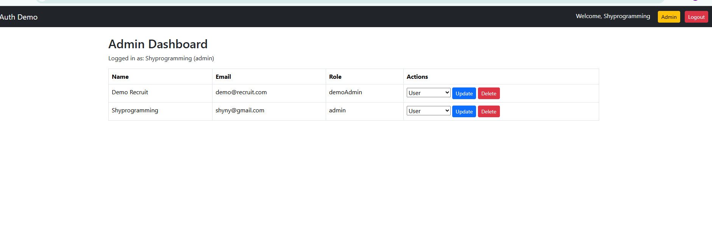
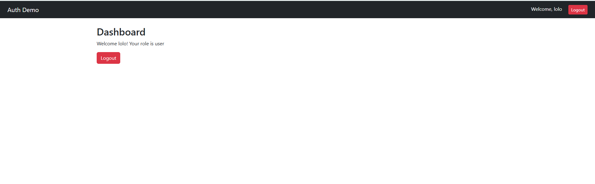

🔐 Auth Rate Limiter API

A secure, scalable Node.js authentication API with built-in rate limiting, audit logging, and JWT-based access control.

Designed to demonstrate full-stack backend skills with Node.js, Express, MongoDB, and Docker, optimized for enterprise-grade security and developer best practices.


----

🚀 Features

*User Authentication & Authorization*

   - Register and login users with hashed passwords (bcrypt)

   - JWT-based session management

   - Protected routes accessible only to authenticated users

*Rate Limiting*

   -  Prevents brute-force attacks on login/register endpoints

   - Configurable per-IP request limits

*Audit Logging*

   - Tracks user actions (login, register, logout)

    - Stores logs securely in MongoDB for compliance and debugging

*Security Best Practices*

   - Password hashing and salting

   - Environment variable configuration via .env

   - Protected routes middleware

   - Health check endpoint `/health`

*Dockerized*

   - Easy setup and deployment using Docker & Docker Compose

   - MongoDB container included for fully isolated environment


---

🛠️ *Tech Stack*

- Backend: Node.js, Express. 

- Database: MongoDB, Mongoose

- Frontend: Handlebars, Bootstrap 5

- Security: JWT authentication, bcrypt password hashing

- Middleware: Custome rate limiter, auth protection

- Containerization: Docker, Docker Compose

- Environment Config: dotenv


---


## 🔐 Demo Credentials

💻 Demo Admin : | Email: demo@recruit.com  | Password: DemoPass123

👩‍💻 Admin :  | Email: shyny@gmail.com  | Password: shyny1

👱 User : | Email: coral@gmail.com   | Password: coral1

- Demo Admin has Read Only Access.
- Admin has full access (view, update, delete & manage users).
- Regular user only experience normal login & user Dashboard.

---

## 📸 Screenshots

### Admin Dashboard


### Demo-Admin Dashboard


### Login Dashboard


---

## Installation
```bash
git clone https://github.com/Awakann/Auth-Rate-Limiter-Api.git
cd auth-rate-limiter-api
npm install
cp .env.example .env
# Add your MongoDB URI and secret keys
npm start


