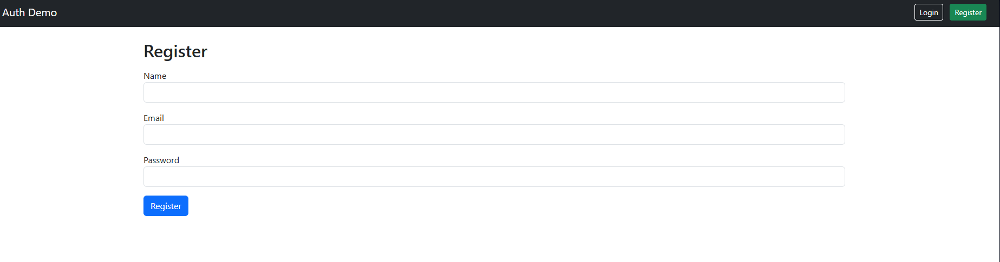
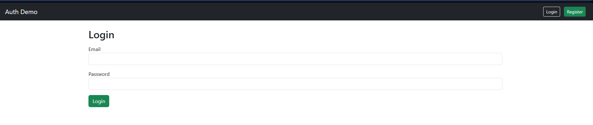
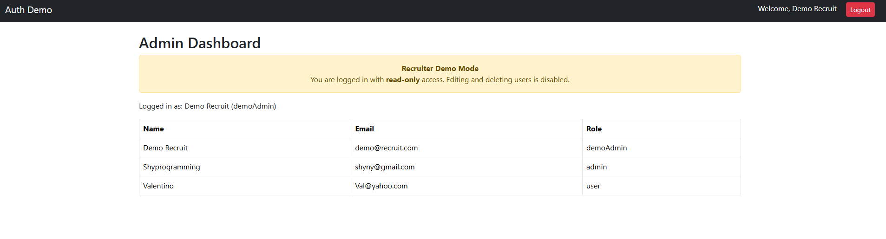

🔐 Auth Rate Limiter API

A secure, scalable Node.js authentication API with built-in rate limiting, audit logging, and JWT-based access control.

Designed to demonstrate full-stack backend skills with Node.js, Express, MongoDB, and Docker, optimized for enterprise-grade security and developer best practices.

[Live Demo] (https://auth-rate-limiter-api.onrender.com/)

----

## Table of Contents
- [Features](#features)
- [Tech Stack](#tech-stack)
- [Demo Credentials](#-demo-credentials)
- [Getting Started](#getting-started)
- [Environment Variables](#environment-variables)
- [API Endpoints](#api-endpoints)
- [Screenshots](#screenshots)
- [Deployment](#deployment)
- [Author](#author)


## 🚀 Features

*User Authentication & Authorization*

   - Register and login users with hashed passwords (bcrypt)

   - JWT-based session management

   - Protected routes accessible only to authenticated users

*Rate Limiting*

   -  Prevents brute-force attacks on login/register endpoints

   - Configurable per-IP request limits

*Audit Logging*

   - Tracks user actions (login, register, logout)

    - Stores logs securely in MongoDB for compliance and debugging

*Security Best Practices*

   - Password hashing and salting

   - Environment variable configuration via .env

   - Protected routes middleware

   - Health check endpoint `/health`

*Dockerized*

   - Easy setup and deployment using Docker & Docker Compose

   - MongoDB container included for fully isolated environment


---

## 🛠️ *Tech Stack*

- Backend: Node.js, Express. 

- Database: MongoDB Atlas, Mongoose

- Frontend: Handlebars, Bootstrap 5

- Security: JWT authentication, bcrypt password hashing

- Middleware: Custome rate limiter, auth protection

- Containerization: Docker, Docker Compose

- Environment Config: dotenv


---


## 🔐 Demo Credentials

💻 Demo Admin : | Email: demo@recruit.com  | Password: DemoPass123

👩‍💻 Admin :  | Email: shyny1@gmail.com  | Password: shyny1

👱 User : | Email: coral@gmail.com   | Password: coral1

- Demo Admin has Read Only Access.
- Admin has full access (view, update, delete & manage users).
- Regular user only experience normal login & user Dashboard.

---

## Getting Started

1. **Clone the repository**
   ```bash
   git clone https://github.com/Awakann/Auth-Rate-Limiter-Api.git
   cd Auth-Rate-Limiter-Api

2. **Install dependencies**
      npm install

3. **Setup environment variables**
   - Create a .env file in the root:
      PORT=7000
      MONGO_URI=<your_mongodb_atlas_uri>
      JWT_SECRET=<your_jwt_secret>
      Demo-Admin-Email=<your choice>
      DemoAdmin-Password=<your choice>
   
4. **Run the server**
      npm start
      Server will run on http://localhost:7000

## Environment Variables

      | Variable   | Description                       |
   |------------|---------------------------------- |
   | PORT       | Port number to run the server     |
   |------------|-----------------------------------|
   | MONGO_URI  | MongoDB Atlas connection string   |
   |------------|-----------------------------------|
   | JWT_SECRET | Secret key for JWT authentication |
   |------------------------------------------------|


## API Endpoints

   | Method | Endpoint            | Description           | Auth Required |
   | ------ | --------------------|-----------------------|-------------- |
   | POST   | /api/auth/register  | Register a new user   | No            |
   |--------|---------------------|-----------------------|---------------|
   | POST   | /api/auth/login     | Login existing user   | No            |
   |--------|---------------------|-----------------------|---------------|
   | GET    | /api/auth/logout    | Logout user           | Yes           |
   |--------|---------------------|-----------------------|---------------|
   | GET    | /api/auth/protected | Access protected data | Yes           |
   |----------------------------------------------------------------------|
   

   
## 📸 Screenshots

   

   

   


## Deployement

This project is deployed on Render: https://auth-rate-limiter-api.onrender.com/

 - Notes for Render:

      - Root Directory: ./

      - Start Command: npm start

    - Environment Variables:

      - PORT = 7000

      - MONGO_URI = your MongoDB Atlas URI

      - JWT_SECRET = your secret key

      - Demo-Admin Login credentials

   
## Author

👤 Awakan

GitHub: https://github.com/Awakann


